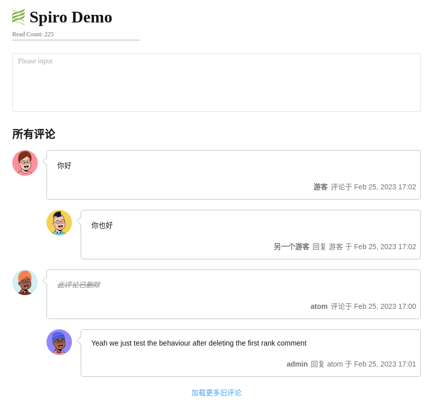

# Spiro

A Comment System With [Backend](https://github.com/coffeehat/Spiro_Backend)


## Features

* You manage your own comment data
* Two levels of comment
* Email notification when receive reply
* Responsive UI
* Support both visitor and registered memeber
* Support article read count

## Install

### Frontend

Spiro is packed in `spiro.js` and `style.css`, you need to import those two files as below.

``` html
<!-- 1. Import CSS -->
<link rel="stylesheet" href="style.css" />

<!-- 2. Create placeholder for Spiro -->
<div id="app"></div>
<div class="read_count_box">Read Count: <span id="read_count"></span></div>

<!-- 3. Mount Spiro -->
<script type="module">
  import { SpiroConfig, mountSpiro, updateReadCount } from "./spiro.js";
  // You need to give server_address and the current page uuid at least
  SpiroConfig.server_addr = "http://127.0.0.1:5000";
  SpiroConfig.article_uuid = "0";
  mountSpiro('app');
  updateReadCount("read_count"); // Optional
</script>
```

You can find a complete but small demo from file `demo.html` 

### BackEnd

Refer to [Spiro Backend](https://github.com/coffeehat/Spiro_Backend) to see how to implement backend

## License

MIT License